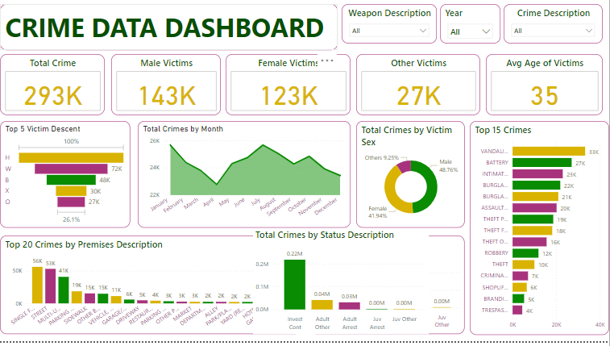

### California_State_Crime_Analysis

## Introduction

Did you know that crime rates in major cities In California have been steadily increasing over the past decade? Imagine having access to a treasure trove of data that can help us understand and combat crime better.  I will present an in-depth analysis of various crime highlighting trends, patterns, and insights that can aid in crime prevention and law enforcement strategies..This Project focuses on crime datasets from the State of California, offering a comprehensive overview of the crime landscape in the State.

## Problem Statement

The Objectives of this analysis are as follow:

- Total number of crimes in the period.

- Total number of male victims.

- Total number of female victims.

- Total number of other victims.

- Average victims age.

- Total crime per month.

- Total crime by status description.

- Top 20 crime by premises description.

- 

-  ## Skills Demostrated

  The following skills are demostrated.

  - Excel for data profiling.
    
  - Measures for KPIs.
    
  - Silcers for filtering.
    
  - Power BI for data visualization.

## Data Sourcing 

This datasets is from www.kaggle.com. it is a csv file with a single table. Its has 14 columns and 339364 rows.

## Data Trnsformation 

The is a clean data with very few null values which  were filtered out. 

## Data Modeling 

These datasets contain two tables therefore data modeling was carried out.

## Data Analysis and Visualization 

- Total number of Crime is 293 ,000 at the time when this dataset was taken.

- Total number of male victims is 143,000   , female victims 123,000 and 27,000 for Other victims.

- Average victims age is 35 years.

- Male victim has the higest number of crimes.

- Vandalism tops the list on higest form of crimes followed by battery respectively.

## Conclusion And Recommendations

Preventing or reducing crime requires a multifaceted approach that involves various stakeholders, including government agencies, law enforcement, communities, and individuals. Here are some measures that can be taken to prevent or reduce crime...

Establish community policing programs where law enforcement officers work closely with the community to build trust, gather information, and address issues collaboratively.

Educate the public about the consequences of crime and the importance of law-abiding behavior through school programs, public campaigns, and community outreach.
 
Invest in after-school programs, mentorship initiatives, and recreational activities for young people to keep them engaged in positive, productive activities.

Implement programs and services to address substance abuse issues, including drug education, rehabilitation, and treatment centers.

Ensure accessible and affordable mental health services to help individuals with mental health challenges, as untreated mental health issues can sometimes lead to criminal behavior.

Create job training programs and support small businesses to improve economic opportunities, particularly in disadvantaged neighborhoods.

Offer parenting classes and family support services to strengthen family structures and reduce risk factors for criminal behavior in children.

Enforce stricter gun control measures, including background checks and waiting periods, to reduce the availability of firearms to potential criminals.
 
Encourage the formation of neighborhood watch programs where residents look out for each other and report suspicious activity to law enforcement.

Examine and reform the criminal justice system to focus on rehabilitation and reintegration rather than solely punitive measures. This may include reducing mandatory minimum sentences and investing in diversion programs.

Promote restorative justice programs that aim to repair the harm caused by a crime, involve victims, and help offenders take responsibility for their actions.

Provide ongoing training for law enforcement officers in de-escalation techniques, cultural sensitivity, and mental health crisis intervention.

Implement modern surveillance technology, such as security cameras and ShotSpotter systems, to deter and respond to criminal activity.

Ensure that victims of crime have access to support services, including counseling, legal assistance, and financial aid.

Address homelessness and housing insecurity, as these issues are often associated with crime. Provide affordable housing options and support services for homeless individuals.
